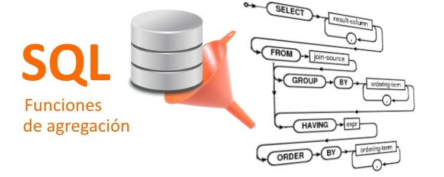

# Ejercicios de colsultas y agregado

> Las **consultas** en SQL Server permiten recuperar, filtrar y organizar datos de una o varias tablas. Las funciones de **agregado** (como SUM, AVG, COUNT) sirven para calcular valores resumen, ayudando a analizar grandes cantidades de datos de forma eficiente.




```sql
-- consultas de agregado 
-- nota solo devuelven un solo gistro
-- sum, avg, count, count(*), max y min
-- avg		-	promedio
-- count	-	cuenta los registos 
-- count(*)	-	cuenta los registros de un apartado
-- max		-	da el maximo valor
-- min		-	da el minimo

-- cuants clientes tengo
USE Northwind;

select count(*) as 'Numero de clientes' 
from Customers;

-- cuanras regiones hay 

select count (Region) from Customers
where Region is null


select count (*) from Customers
where Region is null

select Region from Customers
where Region is not null 
order by Region asc;

select COUNT(distinct Region) as regiones from Customers
where region is not null

--- 06/05/2025---
USE Northwind;

select * from Orders;

select COUNT (*) from Orders;

select COUNT (ShipRegion) as 'regiones envio' from Orders;

select * from Products;

--seleccciona el precio mas bajo de los productos

select min(UnitPrice) as 'precio minimo' from Products;

select avg(UnitsInStock) as 'unidades en stock' from Products;

select min(UnitsInStock) as 'unidades en stock' from Products;

select UnitsInStock as 'unidades en stock' from Products;

-- seleccionar cuantos pedidos ecisten 

select * from Orders;

select count(*) as 'numeros pedidos' from Orders;

-- calcula el total de dinero vendido

select *  from [Order Details]

select sum(UnitPrice * Quantity) as 'total dinero' from [Order Details]

select sum(UnitPrice * Quantity - (unitprice * Quantity * Discount)) 
 as 'total dinero' from [Order Details]

-- calcula el total de unidades en stock de todos los productos

select sum(UnitsInStock) as 'en stock' from Products;

-- seleccionar el total de dinero que se gano en el ultimo trimestre de 1996

select EmployeeID ,COUNT(*) as  ' numero de pedidos'
from Orders
group by EmployeeID

select EmployeeID ,COUNT(*) as  ' numero de pedidos'
from Orders
where OrderDate between '1996-10-1' and '1996-12-31'
group by EmployeeID  


-- seleccionar el numero de productos por categoria 

select CategoryID, count(*) as 'Numero de productos ' from Products
group by CategoryID;

select * from Categories
select * from Products

select * from 
Categories
inner join Products as p 
on Categories.CategoryID = P.CategoryID;

select Categories.CategoryName,
COUNT(*) as [numero de productos]
from 
Categories
inner join Products as p 
on Categories.CategoryID = P.CategoryID
group by Categories.CategoryName;

-- calcular el precio promedio de los productos por cada categoria


select  CategoryID ,AVG(UnitPrice) as 'precio promedio' from Products
group by CategoryID

-- seleccionar el numero de pedidos realisados por cada empleado 
--


select * from Employees
select * from Orders

select EmployeeID, COUNT(*)  from Orders
group by EmployeeID

-- selecccionar la suma total de unidades vendidas por cada producto 

select * from Products
select * from Categories

select CategoryID, sum(UnitPrice) from Products
group by CategoryID

select * from [Order Details]

select sum(Quantity) from [Order Details]

select ProductID ,sum(Quantity) as 'numero de productos vendidos'
from [Order Details]
group by ProductID
order by 2 desc

-- top 5

select top 5 ProductID ,sum(Quantity) as 'numero de productos vendidos'
from [Order Details]
group by ProductID
order by 2 desc

--

select ProductID ,sum(Quantity) as 'numero de productos vendidos'
from [Order Details]
group by ProductID
order by 1 desc
-- 

select  OrderID,ProductID ,sum(Quantity) as 'numero de productos vendidos'
from [Order Details]
group by OrderID, ProductID
order by 2 asc

-- seleccionar el numero de productos po categoria pero solo aquellos donde tengan mas de 10productos 

select * from Products

-- paso 1

select distinct CategoryID from Products

-- paso 

select CategoryID, UnitsInStock from Products 
where CategoryID in (2,4,8)
order by CategoryID

-- paso 3

select CategoryID, UnitsInStock from Products 
where CategoryID in (2,4,8)
group by CategoryID
order by CategoryID

-- paso 4 

select CategoryID, sum(UnitsInStock) 
from Products 
where CategoryID in (2,4,8)
group by CategoryID
having count (*) >=10
order by CategoryID

-- listar las ordenes agrupadas por empleados, pero solo muestre aquellos que hayan gestionado mas de 10 pedidos 

select * from Employees
select * from Orders

-- conultas de agregadi terminadas y having avanzado 
```