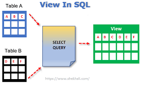

# Views SQL
> Las **Views** en SQL son vistas virtuales que muestran resultados de una consulta predefinida. No almacenan datos, pero permiten simplificar consultas complejas, mejorar la seguridad y facilitar el acceso a información específica sin exponer toda la base de datos.


```sql
-- views

-- sintaxis
/*
create view nombrevista
as select colomnas
from tabla
where condicion
*/

use Northwind
go

create view vistascategoria
as
select c.CategoryID, c.CategoryName, c.[Description] , c.Picture 
from Categories as c
go

drop view vistascategoria
 
select * from Customers

-- crear uma lista que permita visualisar los clientes solamente los clientes 
-- de mexico brazil
GO

-- AL CREARLO NO ES COMPATIBLE CON EL ORDER BY

create OR ALTER view VISTACLIENTESLATINO
as
select * from Customers
where Country in ('mexico', 'brazil')
go


SELECT CompanyName,AS 'CLIENTE', CITY AS [CIUDAD],  Country AS PAIS
FROM VISTACLIENTESLATINO
WHERE CITY = 'SAO PAULO'
ORDER BY  2 DESC

GO

SELECT *  FROM 
ORDERS AS O
INNER JOIN VISTACLIENTESLATINO AS VCL
ON VCL.CustomerID = O.CustomerID

--	CREAR UNA VISTA QUE CONTENGA LOS DATOS DE TODAS LAS ORDENES
--	LOS PRODUCTOS, CATEGORIAS, EMPLEADOS Y CLIENTES DE PRODUCTOS
--	EN ORDEN CALCULAR EL IMPORTE
go

create OR ALTER view [dbo].VistaOrdenesCompras
as
SELECT o.OrderID as 'numero de orden', o.OrderDate as 'fecha orden', 
o.RequiredDate as 'fechA DE REQUISICION', CONCAT(E.FirstName, ' ', E.LastName)
AS 'NOMBRE EMPLEADO', CU.CompanyName AS 'CLIENTE',
P.ProductName AS 'NOMBRE PRODUCTO',
C.CategoryName AS 'CATEGORIA NOMBRE',
OD.UnitPrice AS 'PRECIO DE VENTA',
OD.Quantity AS 'CANTIDAD VENTA',
(OD.Quantity * OD.UnitPrice) AS 'IMPORTE'

FROM
Categories AS C
INNER JOIN 
Products AS P
ON C.CategoryID = P.CategoryID
INNER JOIN [Order Details] AS OD
ON OD.ProductID = P.ProductID
INNER JOIN Orders AS O
ON OD.OrderID = O.OrderID
INNER JOIN Customers AS CU
ON CU.CustomerID = O.CustomerID
INNER JOIN Employees as e
ON e.EmployeeID = o.EmployeeID

select *  from VistaOrdenesCompras
go

select count(distinct [numero de orden]) as 'nuermo orden'
from VistaOrdenesCompras
go

select sum ([CANTIDAD VENTA]* []) from VistaOrdenesCompra

create or alter view vistas_order_1995_1996
as


create schema rh
create table rh.tablarh(
	id int primary key,
	nombre nvarchar(50)
)
-- vista horizontal

create or alter view rh.viewCategoriasProductos
as
select c.CategoryID,c.CategoryName , p.ProductID, p.ProductName 
from
Categories as c
inner join Products as p 
on c.CategoryID = p.CategoryID;
go

select * from rh.viewCategoriasProductos

-- profe 

-- Views

--sintaxis
/*create view nombreVista
AS
select columnas
from tabla
where condicion
*/

use northwind;
go

create or alter view VistaCategoriasTodas
AS
select CategoryID, CategoryName, [Description], picture
from Categories
where CategoryName = 'Beverages'

Go

drop view VistaCategoriasTodas
go

select * from VistaCategoriasTodas
where CategoryName = 'Beverages'

-- Crear una vista que permita visualizar solamente clientes de mexico y brazil
go

create or alter view vistaClientesLatinos
as
select * from Customers
where country in('MExico','Brazil')


select CompanyName as [Cliente],
City as [Ciudad], country as [Pais]
from vistaClientesLatinos
where city = 'Sao Paulo'
order by 2 desc


select * from
Orders as o
inner join vistaClientesLatinos as vcl
on vcl.CustomerID = o.CustomerID

-- Crear una vista que contenga los datos de todas las ordenes
-- los productos, catgorias de productos,empleados y clientes,  
-- en la orden
-- calcular el importe


create or alter view [dbo].[vistaordenescomprass]
as
select o.OrderID as [numero Orden],
o.OrderDate as [Fecha de Orden],
o.RequiredDate as [Fecha de Requisici�n],
concat(e.FirstName, ' ', e.LastName) as [Nombre Empleado],
cu.CompanyName as [Nombre del Cliente],
p.ProductName as [Nombre Producto],
c.CategoryName as [Nombre de la Categoria],
od.UnitPrice as [Precio de Venta],
od.Quantity as [Cantidad Vendida],
(od.Quantity * od.UnitPrice) as [importe]
from  
Categories as c
inner join Products as p
on c.CategoryID = p.CategoryID
inner join [Order Details] as od
on od.ProductID = p.ProductID
inner join orders as o
on od.OrderID = o.OrderID
inner join Customers as cu
on cu.CustomerID = o.CustomerID
inner join Employees as e
on e.EmployeeID = o.EmployeeID

select count(distinct [numero Orden]) as [Numero de Ordenes]
from vistaordenescomprass

select sum([Cantidad Vendida] * [Precio de Venta]) as [importe Total]
from vistaordenescompra
Go

select sum(importe) as [importe Total]
from vistaordenescompra
where year([Fecha de Orden]) between '1995' and '1996'  
Go

create or alter view vista_ordenes_1995_1996
as
select [Nombre del Cliente] as 'Nombre Cliente',
sum(importe) as [importe Total]
from vistaordenescomprass
where year([Fecha de Orden])
between '1995' and '1996'  
group by [Nombre del Cliente]
having count(*)>2


create schema rh

create table rh.tablarh (
  id int primary key,
  nombre nvarchar(50)
)


-- vista horizontal
create or alter view rh.viewcategoriasproductos
as
select c.CategoryID, CategoryName, p.ProductID, p.ProductName
from
Categories as c
inner join Products as p
on c.CategoryID = p.CategoryID;
GO

select * from rh.viewcategoriasproductos
```