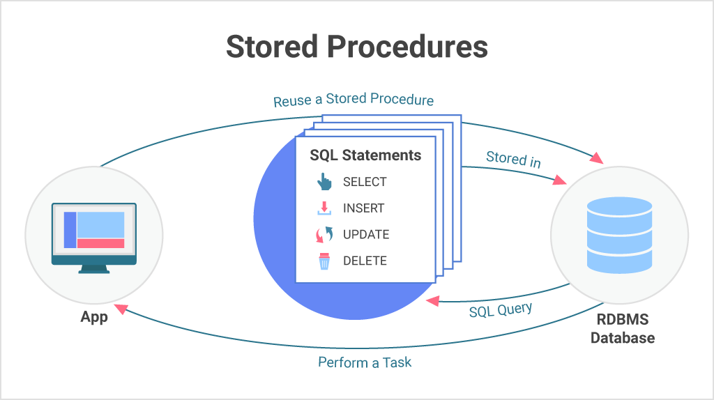

# store prosedures


```sql
-- crear un store procedure para seleccionar los clientes 

create or alter procedure spu_mostrar_clientes
as
begin
select *  from Customers;
end;
go
--ejecutat un store en en transsact

exec spu_mostrar_clientes

-- crear un sp que muestre los cliwntes por pais
--parametros de entrada
go

create or alter procedure spu_custumersforCountry
@pais Nvarchar(15), --parametro de entrada
@pais2 nvarchar(15)
as
begin

select *  from Customers
	where Country in(@pais,@pais2)
	end;
go
--fin primer store

-- ejecuatrar un store procedure

declare @p1 nvarchar(15) = 'spain';
declare @p2 nvarchar(15) = 'germany';

exec spu_custumersforCountry @p1, @p2
go

--general un reporte que permita visualisar los datos de compra de un determinado cliente
-- en un ranfo de fechas, mostando, el toral de compras por productos, mediante un sp.


create or alter procedure spu_custumerPrueva

@fechainicio datetime,
@fechafin datetime
as
begin
select C.CompanyName  from Customers as c
inner join 
Orders as o
on c.CustomerID = o.CustomerID
where  OrderDate between @fechainicio and @fechafin
GROUP BY  C.CompanyName
end;


exec spu_custumerPrueva  '1990-05-02','1995-05-7'

select GETDATE()
GO
--EJE
create or alter proc spu_informe_ventas_clientes
-- PARAMETRO DE ENTRADA CON VALOR POR DEFAUL
@nombre nvarchar(40) = 'Berglunds snabbk�p', 
@fechainicio datetime,
@fechafin datetime
AS
BEGIN
select [Nombre del Cliente],[nombre producto], sum(importe) as [monto total] 
from vistaordenescomprass
 where [Nombre del Cliente]= @nombre
and [fecha de orden] between @fechainicio and @fechafin
group by [Nombre Producto], [Nombre del Cliente]
END;
GO

SELECT * FROM vistaordenescomprass
--EJECUCION DE UN STORE CON PARAMETROS DE ENTRADA
EXEC spu_informe_ventas_clientes 
'Berglunds snabbk�p', '1996-07-04', '1997-01-01'

-- EJECUCION DE UN STORE PROCEDURE CON PARAMETROS DE ENTRADA CON UN CAMPO QUE TIENE UN VALOR POR DEFAULT 
EXEC spu_informe_ventas_clientes 
 @fechainicio= '1996-07-04',
 @fechafin= '1997-01-01'
--EJECUCION DE UN STORE PROCEDURE CON PARAMETROS EN DIFETENTE  POSICION
 EXEC spu_informe_ventas_clientes 
	 @fechainicio= '1996-07-04',
	@nombre = 'Berglunds snabbk�p',
	@fechafin= '1997-01-01'

	go
	-- store procedure con parametros de salida
	--spu store preosedure user
	create or alter proc spu_ObtenerNumeroClientes
	@custumerId nchar(5), --parametro de entrada
	@totalcustumers int output --parametos de salida
	as
	begin
	
		select @totalcustumers=count(*) from Customers 
		where CustomerID = @custumerId;
	end;

	go

	--para ejecutarlo primero se tienen que crear parametros 

	SELECT * FROM Customers

	declare @numero int


	exec  spu_ObtenerNumeroClientes 'ANATR',
								@totalcustumers = @numero output;
	print @numero
	go


	-- crear un store procedure que permita saber si un alumno aprobo o reprobo

	create or alter procedure spu_CompararCalificacion
	@calif decimal(10,2) --parametro entrada
	as
	begin
			
			if @calif>=0 and @calif<=10
			begin

		if @calif>=8
		print 'calificacion es aprovatoria'
		else
		print 'calificacion es reprobatoria'
	end
	else
		print 'calificacion no valida'

	end;
	go

	exec spu_CompararCalificacion @calif = 5

	go
	-- crear un storeprosedure que permita verificar que un cliente existe antes de
	-- devolver la informacion

	create or alter proc  Spu_ObtenerClienteSiExiste
	@numeroCliente nchar(5)
	as
	begin
			if exists (select 1 from Customers where CustomerID = @numeroCliente)
			select * from Customers where CustomerID = @numeroCliente
			else
			print  'cliente no existe'
	end;
	go
	
	select * from Customers
	select 1 from Customers where CustomerID = 'AROUT'
	
	exec Spu_ObtenerClienteSiExiste @numeroCliente = 'AROUT'

	exec Spu_ObtenerClienteSiExiste @numeroCliente = 'IVAN'

	-- crear un store procedure que permita insertar un cliente pero sedeve verificar primero que no exista 

	select * from Customers
	go

	create or alter proc spu_AgregarCliente
		@id nchar(5),
		@nombre nvarchar(40),
		@city nvarchar(15) = 'san migel'

	as 
	begin 

		if exists (select 1 from Customers where CustomerID = @id)
	
		begin
		print('cliente ya existe')
			return 1
		end

		insert into Customers (CustomerID, CompanyName)
		values(@id,@nombre);
		print ('cliente insertado exitosamente');
		return 0; 


		end;
	
exec spu_AgregarCliente 'ALFKI','pato'


exec spu_AgregarCliente 'ALFKC','pato DE HULE'

-- vistas y storesprocedure
go

CREATE OR ALTER PROC spu_AgregarClientestryCatsh
		@id nchar(5),
		@nombre nvarchar(40),
		@city nvarchar(15) = 'san migel'
			as
			begin 
			begin  try
		insert into Customers (CustomerID, CompanyName)
		values(@id,@nombre);
		print ('cliente insertado exitosamente');
			end try
			begin catch
				print ('cliente no insertado ')
			end catch
	end;
	go
	
exec spu_AgregarClientestryCatsh 'ALFKC','pato DE HULE'


--- manejo de ciclos en un store procedure 
-- imprimir el numero de veces que indique el usuario
go

create or alter procedure spu_imprimir
@numero int
as 
begin
	if @numero<=0
	begin -- se tiene que colocar esto porque si no solo toma la primera linea que encuentra
			print ('numero no puede ser 0 o negativo')
			return
		end
	declare @i int 
	set @i= 1
	while(@i<=@numero)
	begin 
		print concat( 'numero ' , @i)
		set @i = @i +1
		
	end
end;
go

exec spu_imprimir  10

```