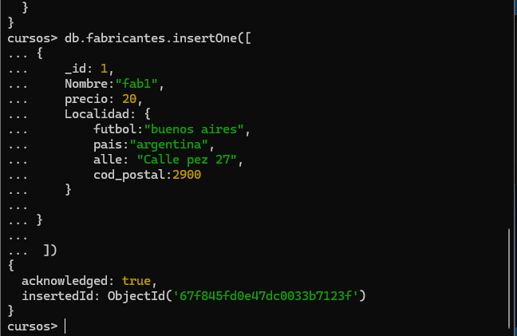

# Practica 1: Base de Datos, colecciones e inserts

1. Conectarnos con mongosh a MongoDB
    ```json
    mongosh
    ```
    

1. Crear una base de datos llamada curso
    ```json
    use curso
    ```
      
1. Comprobar que la base de datos no existe
```json
    show databases
```
   
1. Crear una coleccion que se llame facturas y mostrarla
```json
db.createCollection('facturas')
 show collections
 ```


5. Insertar un documento con los siguientes datos:

| Codigo   | Valor   |
|-------------|-------------|
| Cod_Factura | 10 |
| Ciente | Frutas Ramirez |
| Total | 223 |

| Codigo   | Valor   |
|-------------|-------------|
| Cod_Factura | 20 |
| Ciente | Ferreteria Juan |
| Total | 140 |

```json
db.facturas.insertMany([
{
  Cod_Factura: 10,
  Ciente: "Frutas Ramirez" ,
  Total: 223
 }
 ,
 {
    Cod_Factura: 20,
    Ciente: "Ferreteria Juan",
    Total: 140
 
 }
 ])
```

6. Crear una nueva colección  "producto" pero usando directamente el insertOne.
   insertar un documento en la colección productos con los siguientes datos:

| Codigo   | Valor   |
|-------------|-------------|
| Cod_producto | 1 |
| Nombre | Tornillo x 1" |
| Precio | 2 |

```json
 db.createCollection('producto')

db.producto.insertOne([
{
    Cod_producto: 1,
    Nombre: "Tornillo x 1" ,
    precio: 2
 }
 
 ])
```


7. Crear un nuevo documento de producto que contenga un array. Con los siguientes datos:

| Codigo   | Valor   |
|-------------|-------------|
| Cod_producto | 2 |
| Nombre | Martillo |
| Precio | 20 |
| Unidades | 50 |
| Fabricantes | fab1, fab2, fab3,fab4 |


```json

db.producto.insertOne([
{
    Cod_producto: 2,
    Nombre: "Martillo" ,
    precio: 20,
    Unidades: 50,
    Fabricantes:[
        'fab1', 'fab2', 'fab3'
    ]
}
 
 ])
```


8. Borrar la colección Facturas y comprobar que se borro


```json

 db.Facturas.drop()

  show collections
```


9. Insertar un documento en una colección denominada **fabricantes**
   para probar los subdocumentos y la clave _id personalizada

| Codigo   | Valor   |
|-------------|-------------|
| id | 1 |
| Nombre | fab1 |
| Localidad | ciudad: buenos aires, pais: argentina, Calle: Calle pez 27,cod_postal:2900 |
```json
 db.createCollection('fabricantes')

db.fabricantes.insertOne([
{
    _id: 1,
    Nombre:"fab1",
    precio: 20,
    Localidad: {
        futbol:"buenos aires",
        pais:"argentina",
        alle: "Calle pez 27",
        cod_postal:2900
    }
  
}
 
 ])
```


10. Realizar una inserción de varios documentos en a colección
    productos

| Codigo   | Valor   |
|-------------|-------------|
| Cod_producto | 3 |
| Nombre | Alicates |
| Precio | 10 |
| Unidades | 25 |
| Fabricantes | fab1, fab2, fab5 |

| Codigo   | Valor   |
|-------------|-------------|
| Cod_producto | 4 |
| Nombre | Arandela |
| Precio | 1 |
| Unidades | 500 |
| Fabricantes | fab2, fab3, fab4 |

```json

db.producto.insertMany([
{
     Cod_producto: 3,
    Nombre: "Alicates" ,
    Precio: 10,
    Unidades: 50,
    Fabricantes:[
        'fab1', 'fab2', 'fab5'
    ]
},
{
    Cod_producto: 4,
    Nombre: "Arandela" ,
    Precio: 1,
    Unidades: 50,
    Fabricantes:[
        'fab2', 'fab3', 'fab4'
    ]
}
 
 ])
```
