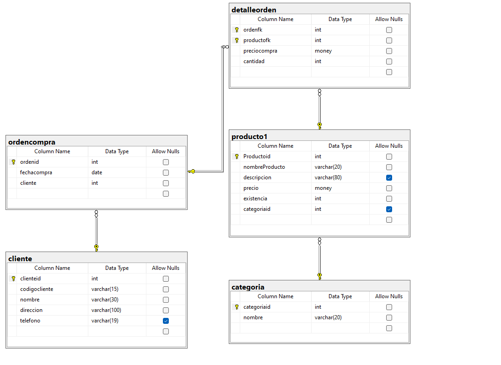

# Ejrecicio de creación de baces de datos con SQL-LDD


```sql

create database tienda1;

use tienda1;
-- tabla productos

create table categoria(
	categoriaid int not null,
	nombre varchar(20) not null,
	constraint pk_categoria
	primary key (categoriaid),
	constraint unico_nombre
	unique (nombre)
);

--sql lmd
--agregar registros a la tabla

insert into categoria
values(1,'carnes frias');

insert into categoria(categoriaid,nombre)
values(2, 'linea blanca');

insert into categoria(nombre,categoriaid)
values('vinos y  licores', 3);

insert into categoria
values( 4, 'ropa'),
		(5,'dulces'),
		(6,'lacteos');

insert into categoria(nombre,categoriaid)
values('panaderia', 7),
		('zapateria',8),
		('jugeteria',9);

-- en myslq es decimal
create table producto1(
	Productoid int not null,
	nombreProducto varchar (20) not null,
	descripcion varchar (80),
	precio money not null,
	existencia int not null,
	categoriaid int null,
	constraint pk_producto1
	primary key (Productoid),
	constraint unico_descriocion
	unique(nombreProducto),
	constraint chk_precio
	check(precio> 0.0 and precio<= 1000),
	constraint chk_existencia
	check(existencia> 0.0 and existencia<= 1000),
	constraint fk_categoria_producto1
	foreign key (categoriaid)
	references categoria(categoriaid)

);
/*
create table producto1(
productId int not null,
nombreProducto varchar (20) not null,
descripcion varchar (80),
precio money not null,
existencia int not null,
categoriaID int null,
constraint pk_producto1
primary key (productId),
constraint unico_nombreProducto
unique (nombreProducto),
constraint chk_precio
check (precio > 0.0 and precio <= 1000),
constraint chk_existencia
check (existencia > 0 and existencia <= 200),
constraint fk_categoria_producto1
foreign key (categoriaID)
references categoria (categoriaID)
)
*/

select * from categoria
order by categoriaid asc;

insert into producto1
values(1,'migelito','dulce sano para la lombris=z',34.5,45,5);

insert into producto1
values(2,'tupsi pop','dulce re sano para  el diente',5,50,5);

insert into producto1
values(3,'plancha','plancha facil el suit',34.5,45,2);

select * from producto1
where categoriaid=5

create table cliente(
	clienteid int not null identity(1,1),
	codigocliente varchar(15) not null,
	nombre varchar(30) not null,
	direccion varchar(100) not null,
	telefono varchar(19),
	constraint pk_cliente
	primary key(clienteid),
	constraint unico_codigocliente
	unique (clienteid)

);

create table detalleorden (
	ordenfk int not null,
	productofk int not null,
	preciocompra money not null,
	cantidad int not null,
	constraint pk_detalleorden
	primary key(ordenfk ,productofk),
	constraint chk_preciocompra
	check (preciocompra>0.0 and preciocompra<=20000),
	constraint chk_cantidad
	check (cantidad>0),
	constraint fk_detalleornden_producto
	foreign key (Productofk)
	references producto1(Productoid)

);

create table ordencompra (
		ordenid int not null identity (1,1),
		fechacompra date not null,
		cliente int not null,
		constraint pk_ordencompra
		primary key (ordenid),
		constraint fk_ordencompra_cliente
		foreign key (cliente)
		references cliente(clienteid)
);

alter table detalleorden
add constraint fk_detalleorden_ordencompra
foreign key (ordenfk)
references ordencompra(ordenid);
```
## diagrama resultante 


